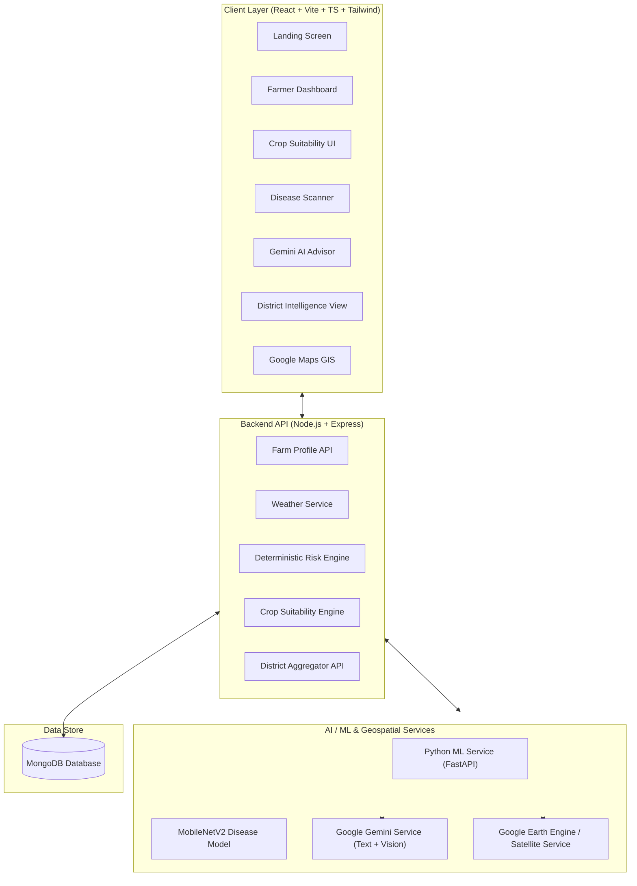

# AgriMitra Climate — Hackathon Implementation Plan

> **Hackathon Track:** BRICS Theme — Cooperation / Digital Agriculture  
> **Build Window:** 48 Hours  
> **Base Foundation:** AgriMitra (React/Vite + Node/Express + Python/FastAPI + MongoDB)  
> **Primary AI & Satellite:** Google Gemini AI + Google Earth Engine  
> **Deployment Strategy:** Fresh deployment at final project completion (independent of old Vercel setup)  

---

## 1. Executive Summary & Strategy

**AgriMitra Climate** substantially extends the original AgriMitra project into a climate-smart digital agriculture platform. It transforms fragmented signals—weather, soil, satellite indices, crop health, and disease diagnosis—into actionable farm intelligence, crop suitability rankings, deterministic risk assessments, localized AI advisories, and district-level decision support for agricultural officers.

### Architectural Principles
1. **Deterministic Computation + AI Explanation:** Scores (Farm Risk, Crop Suitability) are calculated deterministically by application logic; Google Gemini explains the score and provides actionable guidance without fabricating numbers.
2. **Hybrid & Resilient Data Strategy:** Uses live APIs (Weather, Earth Engine, Gemini) with pre-seeded datasets and graceful fallbacks so service interruptions never crash the application.
3. **Dual View Experience:** Seamlessly toggle between **Farmer View** (individual farm health, advisory, crop recommendations, disease scanner) and **District Intelligence View** (regional risk maps, crop concentration, government interventions).
4. **Clean & Fresh Deployment:** The application will be deployed cleanly as a new service at the end of feature completion. Old Vercel project settings/configs are ignored.

---

## 2. Architecture & Tech Stack

---

## 3. Phased Implementation Roadmap

### Phase 1: Environment & Baseline Verification
- [x] Audit workspace and existing baseline (`client/`, `server/`, `ml-service/`).
- [ ] Verify environment variables (`.env`) for Node server, FastAPI service, and client app.
- [ ] Configure key API tokens: `GEMINI_API_KEY`, `OPENWEATHER_API_KEY` (or fallback), `GOOGLE_MAPS_API_KEY`, and Google Earth Engine credentials.
- [ ] Ensure MongoDB connection and local test runs for `server` and `ml-service`.

---

### Phase 2: Core Data Schemas & Farm Profile API
- **Data Models (MongoDB / Mongoose):**
  - `Farmer` & `Farm`: Location (`lat`, `lng`), `state`, `district`, `areaAcres`, `crop`, `season`, `soil` (type, NPK, moisture), `irrigation`, `language`.
  - `WeatherSnapshot` & `SatelliteSnapshot`: Store cached weather forecasts and satellite indicators (NDVI, vegetation health score).
  - `FarmRisk` & `DiseaseAnalysis`: Store risk breakdown and leaf analysis history.
- **Backend Endpoints:**
  - `POST /api/farms`: Create/Update farm profile.
  - `GET /api/farms/:id`: Fetch complete farm profile.
  - `GET /api/farms/farmer/:farmerId`: Fetch list of farms for a user.

---

### Phase 3: Weather & Deterministic Risk Engine
- **Weather Service (`/api/weather`):**
  - Fetch 5-7 day forecast, temperature, humidity, rainfall probability, and wind speed.
  - Implement fallbacks for API rate limits or missing credentials.
- **Farm Risk Engine (`/api/farms/:id/risk`):**
  - Calculate normalized score (0–100):
    $$\text{Risk} = 0.30(\text{Water}) + 0.20(\text{Heat}) + 0.20(\text{Disease}) + 0.15(\text{Rainfall}) + 0.15(\text{Vegetation})$$
  - Categorize into **LOW** (0–30), **MEDIUM** (31–60), **HIGH** (61–80), **CRITICAL** (81–100).
  - Produce sub-risk breakdowns for UI visual gauges.

---

### Phase 4: Crop Suitability Engine & Seed Dataset
- **Curated Dataset (`crops.json` / Database):**
  - 10 core crops (Wheat, Mustard, Chickpea, Barley, Millet, Maize, Rice, Cotton, Groundnut, Sorghum) with optimal climate, soil, water, and temperature parameters.
- **Suitability Algorithm (`/api/recommendations/crops`):**
  - Match farm parameters against crop requirement matrices.
  - Calculate percentage score per crop (e.g., Mustard 91%, Chickpea 87%, Wheat 72%).
- **Gemini Explanation:**
  - Send structured matching scores to Gemini to produce concise, human-readable explanations of *why* specific crops are suitable.

---

### Phase 5: Gemini Agro-Advisory & Multilingual Service
- **Structured Gemini Prompting (`/api/advisory`):**
  - Pass complete farm context (crop, soil, weather, satellite NDVI, risk scores, language preference).
  - Enforce JSON response format: `{ summary, risks[], actions[], irrigationAdvice, weatherAdvice, monitoringAdvice[] }`.
- **Multilingual Support (English, Hindi, Gujarati):**
  - Configure Gemini system prompts to return native language output based on farm profile language setting.

---

### Phase 6: Satellite Intelligence & Disease Integration
- **Satellite Service (`/api/satellite`):**
  - Integrate Google Earth Engine API (or precomputed Sentinel/MODIS NDVI fallback dataset per district/location).
  - Returns: NDVI index, vegetation health status, satellite observation date.
- **Crop Disease Pipeline (`/api/disease/analyze`):**
  - Connect client image upload to Python FastAPI `MobileNetV2` service.
  - Fall back to Gemini 1.5/2.0 Flash Vision when model confidence is low (< 70%).
  - Automatically feed detected disease results into the Farm Risk Engine and Agro-Advisory prompt.

---

### Phase 7: District Agriculture Dashboard & Map (Officer View)
- **District Aggregator (`/api/district/summary`):**
  - Aggregate farm profiles and simulated district datasets (10 districts, 100 sample farms).
  - Summarize risk levels, water stress clusters, dominant crops, and disease occurrences.
- **Government Intervention Generator (`/api/district/interventions`):**
  - Gemini prompt using aggregated district signals to suggest 3-5 prioritized agricultural interventions (e.g., promoting micro-irrigation, drought-resilient seed distribution).
- **Google Maps GIS Component:**
  - Interactive map displaying district overlays, farm markers, risk heat-color coding (🟢 Low, 🟡 Med, 🟠 High, 🔴 Critical).

---

### Phase 8: UI/UX Implementation (React + Vite + Tailwind)
1. **Landing Page:** Platform overview, feature highlights, quick start trigger.
2. **Farmer Dashboard:** Farm profile selection, key metrics grid, weather forecast cards, farm risk visualizer, one-click AI Advisory trigger.
3. **Crop Suitability Screen:** Interactive crop comparison cards, suitability match %, detailed Gemini explanations.
4. **Disease Scanner Screen:** Drag-and-drop leaf upload, preview, confidence score, treatment recommendations.
5. **Contextual AI Chatbot:** Multi-turn chat assistant aware of selected farm profile.
6. **District Intelligence Dashboard:** Toggle switch (Farmer vs Officer), interactive risk map, district metrics, government advisory panel.

---

### Phase 9: Fresh Project Deployment & Final Deliverables
- [ ] Create seed database script (`seed.ts`) populating 10 districts and 100 demo farms.
- [ ] Test end-to-end user flows (Farm creation → Weather/Satellite fetch → Risk Engine → AI Advisory → Disease Scan → District Map).
- [ ] Verify fallback behavior when external APIs (Gemini/Weather) are offline or unconfigured.
- [ ] Perform a **fresh deployment** at project completion for `AgriMitra-Climate`.
- [ ] Update repository `README.md` highlighting original baseline vs. hackathon extensions.

---

## 4. Work Breakdown & Execution Priorities

| Priority | Feature / Module | Dependency | Risk Level |
|---|---|---|---|
| **P0** | Farm Profile & Schemas | MongoDB setup | Low |
| **P0** | Weather Service & Risk Calculation | Weather API / Data schema | Low |
| **P0** | Crop Suitability Engine + Gemini Explanation | Crop dataset | Medium |
| **P0** | Gemini Agro-Advisory (JSON format, Multilingual) | Gemini API key | Medium |
| **P0** | Disease Detection Pipeline | Python FastAPI | Medium |
| **P1** | Google Earth Engine / Satellite Indicators | GEE credentials / Fallback dataset | Medium |
| **P1** | District Agriculture Dashboard & Interactive Map | Google Maps API, Aggregator API | Low |
| **P1** | Government Intervention Suggestions | District Aggregation | Low |
| **P2** | Voice Assistant & Audio Playback | Speech-to-Text / TTS API | High |

---

## 5. Verification Checklist

To confirm complete implementation before final submission:
1. **Build Verification:** Run `npm run build` in both `client` and `server`, and run FastAPI app in `ml-service` with zero unhandled errors.
2. **End-to-End Workflow Test:**
   - Create a farm in Alwar, Rajasthan (Wheat, 2 acres, Loamy soil, Limited irrigation).
   - View populated 7-day weather & calculated MEDIUM farm risk score.
   - Run Crop Suitability recommendation (verify Mustard rank #1, Chickpea rank #2).
   - Upload leaf image for disease diagnosis (verify predicted condition & advice).
   - Generate localized AI Agro-Advisory in Hindi.
   - Switch to District View and verify Alwar aggregate risk and AI government intervention output.
3. **Hackathon Compliance:** Confirm original codebase is documented as baseline and all new features are distinctly committed.
4. **Clean Fresh Deployment:** Deploy `AgriMitra-Climate` freshly upon full build completion.
